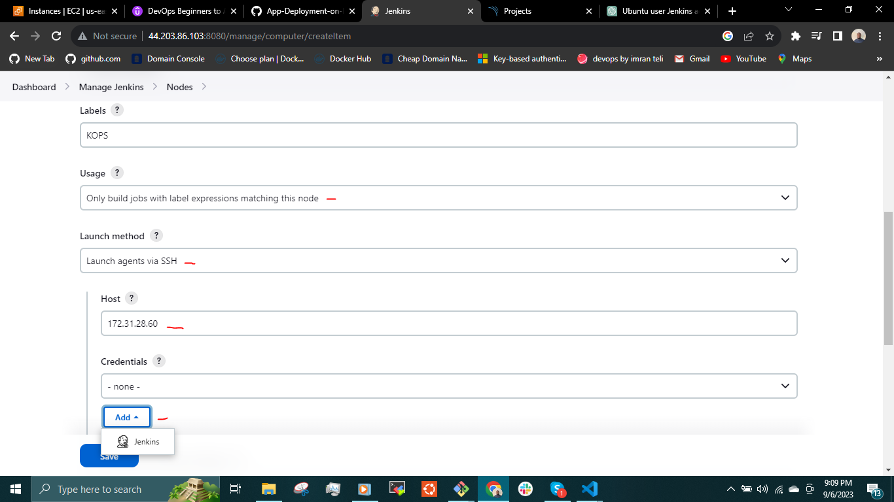

## __IMPLEMENTING AUTOMATED CONTINUOUS DELIVERY TO KUBERNETES CLUSTER__

In this project, my goal is to establish a system designed to consistently build Docker images and seamlessly deploy the images to a Kubernetes cluster.

__SCENARIO__

Developers consistently enhance the application, striving for ongoing improvements. Simultaneously, the operations team is tasked with the responsibility of frequent deployment requests which is essential for effectively managing and operating the Kubernetes cluster.

__CHALLENGE__

Given that the Operations team manually handles deployments, the process is subject to human intervention, resulting in dependencies and significant time consumption.

__SOLUTION__

To address this challenge, the solution lies in implementing an automated deployment framework. This framework will encompass continuous integration, testing, regular image building, and uninterrupted deployment. As soon as a developer commits code changes, the system will instantaneously initiate the image building process and deploy containers to the Kubernetes cluster, ensuring a rapid and streamlined deployment pipeline.

__TOOLS__

The project will utilize the following tools:

- __Kubernetes__ - For orchestrating container deployment
- __Docker  runtime environment__ - For building and testing docker images.
- __Jenkins__ - CI/CD tool for the process.
- __Dockerhub__ - To serve as a repository for the images.
- __Helm__ - For packaging and deploying the images to kubernetes cluster.
- __Git__ - For Version control system.
- __Maven__ - To build the java code.
- __Sonarqube__ - For code analysis.

__ARCHITECTURE DESIGN__


When a developer makes changes to the code and commits them to the Git repository, Jenkins takes action. Jenkins retrieves the updated code, which includes the Dockerfile required to build the Docker image. Jenkins proceeds to collect all code modifications and initiates a sequence of actions which include tests and code analysis. Utilizing tools such as Checkstyle and the SonarQube scanner, it evaluates the code's quality. The outcome of this evaluation is then transmitted to the SonarQube server.

In the event that the code meets the established quality criteria, Jenkins advances to the subsequent stages. Initially, it triggers the Maven build process to build the code into an artifact. Following the successful Maven build, the process transitions to building the Docker image. This entails the build of the Docker image based on the specifications in the Dockerfile. Should all these steps go through without issue, the resulting Docker image is subsequently uploaded to Dockerhub.

Once the Docker image is successfully uploaded to Docker Hub, Jenkins transitions to employing Helm. It incorporates a Kubernetes Operations (kops) Virtual Machine to function as a slave. Through this slave, Jenkins employs kops to orchestrate the deployment of Helm charts onto the Kubernetes cluster. The Helm chart serves as a blueprint for the creation of Kubernetes objects. When these services are already in existence, the Helm chart adeptly implements modifications, such as the application pod receiving an updated image tag.

__FLOW OF EXECUTION__

- Continuous Integration setup
   - Jenkins and Sonarqube
- Dockerhub account
- Store dockerhub credentials in Jenkins
- Setup docker engine in Jenkins
- Install plugins in Jenkins
   - sonaqube scanner plugin
   - Docker plugin
   - Docker pipeline plugin
   - Pipeline utility plugin
   - Build Timestamp plugin
   - Pipeline maven integration
- Create kubernetes cluster with kops
- Install helm in the kops instance/VM.
- Create helm charts
- Test the helm charts in kubernetes cluster in test namespace.- testing the entire stack.
- Add kops instance/VM as Jenkins slave.
- Create  Jenkinsfile.
- Update Git repo with:
   - Jenkinsfile
   - Dockerfile
   - Helm Chart
- Create Jenkins job for pipeline
- Run and test the job.

Create two instances to set up __Jenkins__ and __SonarQube servers__. Utilize the __"userdata"__ option to provision these servers by executing the following scripts:


__For jenkins server__
```
#!/bin/bash

# The jenkins & docker shell script that will run on instance initialization


# Install jenkins and java
sudo apt-get update
sudo apt install openjdk-17-jre -y

curl -fsSL https://pkg.jenkins.io/debian-stable/jenkins.io-2023.key | sudo tee \
  /usr/share/keyrings/jenkins-keyring.asc > /dev/null
echo deb [signed-by=/usr/share/keyrings/jenkins-keyring.asc] \
  https://pkg.jenkins.io/debian-stable binary/ | sudo tee \
  /etc/apt/sources.list.d/jenkins.list > /dev/null
sudo apt-get update
sudo apt-get install jenkins -y


# Install docker
sudo apt-get install ca-certificates curl gnupg -y

sudo install -m 0755 -d /etc/apt/keyrings
curl -fsSL https://download.docker.com/linux/ubuntu/gpg | sudo gpg --dearmor -o /etc/apt/keyrings/docker.gpg
sudo chmod a+r /etc/apt/keyrings/docker.gpg
echo \
  "deb [arch="$(dpkg --print-architecture)" signed-by=/etc/apt/keyrings/docker.gpg] https://download.docker.com/linux/ubuntu \
  "$(. /etc/os-release && echo "$VERSION_CODENAME")" stable" | \
  sudo tee /etc/apt/sources.list.d/docker.list > /dev/null

sudo apt-get update
sudo apt-get install docker-ce docker-ce-cli containerd.io docker-buildx-plugin docker-compose-plugin -y


# Add ubuntu & Jenkins to the Docker group
sudo usermod -aG docker ubuntu
sudo usermod -aG docker jenkins

# run docker test container 
sudo docker run hello-world

# install aws cli
curl "https://awscli.amazonaws.com/awscli-exe-linux-x86_64.zip" -o "awscliv2.zip" 
sudo apt install unzip
sudo unzip awscliv2.zip  
sudo ./aws/install
aws --version

# start & enable jenkins
sudo systemctl start jenkins
sudo systemctl enable jenkins
```
The script above installs __Jenkins__ and __Docker__, and subsequently adds both the __ubunutu user__ and __Jenkins__ to the __Docker__ group.

__for sonarqube server:__
```
#!/bin/bash
cp /etc/sysctl.conf /root/sysctl.conf_backup
cat <<EOT> /etc/sysctl.conf
vm.max_map_count=262144
fs.file-max=65536
ulimit -n 65536
ulimit -u 4096
EOT
cp /etc/security/limits.conf /root/sec_limit.conf_backup
cat <<EOT> /etc/security/limits.conf
sonarqube   -   nofile   65536
sonarqube   -   nproc    409
EOT

sudo apt-get update -y
sudo apt-get install openjdk-11-jdk -y
sudo update-alternatives --config java

java -version

sudo apt update
wget -q https://www.postgresql.org/media/keys/ACCC4CF8.asc -O - | sudo apt-key add -

sudo sh -c 'echo "deb http://apt.postgresql.org/pub/repos/apt/ `lsb_release -cs`-pgdg main" >> /etc/apt/sources.list.d/pgdg.list'
sudo apt install postgresql postgresql-contrib -y
#sudo -u postgres psql -c "SELECT version();"
sudo systemctl enable postgresql.service
sudo systemctl start  postgresql.service
sudo echo "postgres:admin123" | chpasswd
runuser -l postgres -c "createuser sonar"
sudo -i -u postgres psql -c "ALTER USER sonar WITH ENCRYPTED PASSWORD 'admin123';"
sudo -i -u postgres psql -c "CREATE DATABASE sonarqube OWNER sonar;"
sudo -i -u postgres psql -c "GRANT ALL PRIVILEGES ON DATABASE sonarqube to sonar;"
systemctl restart  postgresql
#systemctl status -l   postgresql
netstat -tulpena | grep postgres
sudo mkdir -p /sonarqube/
cd /sonarqube/
sudo curl -O https://binaries.sonarsource.com/Distribution/sonarqube/sonarqube-8.3.0.34182.zip
sudo apt-get install zip -y
sudo unzip -o sonarqube-8.3.0.34182.zip -d /opt/
sudo mv /opt/sonarqube-8.3.0.34182/ /opt/sonarqube
sudo groupadd sonar
sudo useradd -c "SonarQube - User" -d /opt/sonarqube/ -g sonar sonar
sudo chown sonar:sonar /opt/sonarqube/ -R
cp /opt/sonarqube/conf/sonar.properties /root/sonar.properties_backup
cat <<EOT> /opt/sonarqube/conf/sonar.properties
sonar.jdbc.username=sonar
sonar.jdbc.password=admin123
sonar.jdbc.url=jdbc:postgresql://localhost/sonarqube
sonar.web.host=0.0.0.0
sonar.web.port=9000
sonar.web.javaAdditionalOpts=-server
sonar.search.javaOpts=-Xmx512m -Xms512m -XX:+HeapDumpOnOutOfMemoryError
sonar.log.level=INFO
sonar.path.logs=logs
EOT

cat <<EOT> /etc/systemd/system/sonarqube.service
[Unit]
Description=SonarQube service
After=syslog.target network.target

[Service]
Type=forking

ExecStart=/opt/sonarqube/bin/linux-x86-64/sonar.sh start
ExecStop=/opt/sonarqube/bin/linux-x86-64/sonar.sh stop

User=sonar
Group=sonar
Restart=always

LimitNOFILE=65536
LimitNPROC=4096


[Install]
WantedBy=multi-user.target
EOT

systemctl daemon-reload
systemctl enable sonarqube.service
#systemctl start sonarqube.service
#systemctl status -l sonarqube.service
apt-get install nginx -y
rm -rf /etc/nginx/sites-enabled/default
rm -rf /etc/nginx/sites-available/default
cat <<EOT> /etc/nginx/sites-available/sonarqube
server{
    listen      80;
    server_name sonarqube.groophy.in;

    access_log  /var/log/nginx/sonar.access.log;
    error_log   /var/log/nginx/sonar.error.log;

    proxy_buffers 16 64k;
    proxy_buffer_size 128k;

    location / {
        proxy_pass  http://127.0.0.1:9000;
        proxy_next_upstream error timeout invalid_header http_500 http_502 http_503 http_504;
        proxy_redirect off;
              
        proxy_set_header    Host            \$host;
        proxy_set_header    X-Real-IP       \$remote_addr;
        proxy_set_header    X-Forwarded-For \$proxy_add_x_forwarded_for;
        proxy_set_header    X-Forwarded-Proto http;
    }
}
EOT
ln -s /etc/nginx/sites-available/sonarqube /etc/nginx/sites-enabled/sonarqube
systemctl enable nginx.service
#systemctl restart nginx.service
sudo ufw allow 80,9000,9001/tcp

echo "System reboot in 30 sec"
sleep 30
reboot
```


Ensure that the Jenkins security group permits SSH and HTTP traffic, allowing communication both from and to the SonarQube server.

__Jenkins security group__


__Sonarqube security group__


__Sonarqube Setup__

Log into the sonarqube server and generate a token. Save it in the jenkins server.

```
username: admin

password: admin
```


Generate token


Set Quality gate for the code.

A Quality Gate in SonarQube is a set of predefined criteria or rules that are used to assess the quality of your code and determine whether it meets the required quality standards. Quality Gates are an essential part of continuous integration and continuous delivery (CI/CD) pipelines, as they help ensure that only high-quality code is promoted to the next stage of the development process or deployed to production.


In the above screenshot, we set the quality gate to __60__


We will build the  artifact using the  Jenkinsfile pipeline. When the artifact is pushed to sonarqube we can then link the __Quality gate__ to the project and create a __jenkins webhook__.

__Jenkins Setup__

Go to Jenkins, install sonarqube scanner plugin


Go to __Dashboard > manage jenkins > tools__ and set up the sonar scanner installation.


Go to __Dashboard > manage jenkins > system configuration__


Apply and save. Then open __Dashboard > manage jenkins > system configuration__ again


__Add dockerhub credentials to Jenkins__

Add the dockerhub credentials(username and password) to Jenkins. Go to __Dashboard > manage jenkins > credentials__ 


__Install Plugins__

Go to __manage jenkins > plugins__ Install the plugins
- Docker plugin
- Docker pipeline plugin
- Pipeline utility steps plugin
- Build Timestamp plugin


__Create kubernetes cluster with kops and install Helm__

Create an instance and setup the kubernetes cluster using kops. Click [here](https://github.com/dybran/Kubernetes-Cluster-Setup-with-Kops/blob/main/Kubernetes-setup-with-kops.md) for the setup.


Create configurations for the cluster and store them in s3 bucket.

`$ kops create cluster --name=mydevopsproject.top --state=s3://project-kops-state --zones=us-east-1a,us-east-1b --node-count=2 --node-size=t3.small --master-size=t3.medium --dns-zone=mydevopsproject.top --node-volume-size=8 --master-volume-size=8`


Configure and create cluster

`$ kops update cluster --state=s3://project-kops-state --name mydevopsproject.top --yes --admin`


Wait for 15mins and validate cluster

`$ kops validate cluster --name=mydevopsproject.top --state=s3://project-kops-state`


Install __Helm__ in the kops instance. Refer to the documentation on the __installation guide__ [here](https://helm.sh/docs/intro/install/). We will add the kops instance as a slave to Jenkins and run Helm commands from kops instance.


Copy the link and download the binary.


`$ cd /tmp/`

`$ wget https://get.helm.sh/helm-v3.12.3-linux-amd64.tar.gz`

To make helm globally accessible in kops instance

`$ sudo mv linux-amd64/helm /usr/local/bin/helm`

`$ cd ~`

`$ helm version`


Create the helm chart and move the definition files in __kubernetes__ to __helm/vprocharts/templates__

`$ mkdir helm && cd helm`

`$ helm create vprocharts`

`$ cd vprocharts`

Remove the content of __templates__

`$ rm -rf helm/vprocharts/templates/*`

Copy the definition file in the __kubernetes__ directory.

`$ cp -r ../../kubernetes/* ./templates`


In the __app-deployment.yml__ file, we use a variable to dynamically substitute the image value. When we execute the Helm command, it will automatically inject the latest version and tag for the __appimage__.


__Test the helm chart__

Create a namespace __test__

`$ kubectl create namespace test`

`$ helm install --namespace test vpro-stack  helm/vprocharts --set appimage=dybran/vprofileapp:latest`


Execute the following command to view the services, pods, and deployments within the __"test"__ namespace:

`$ kubectl get all --namespace test`

To obtain the Load Balancer endpoint, use the following command:

`$ kubectl get svc app-service --namespace test`


Access from the browser


To delete the __vpro-stack__ that was created

`$ helm delete vpro-stack --namespace test`

To delete the __test__ namespace

`$ kubectl delete namespace test`


Create the __Prod__ namespace for the __Jenkinsfile__

`$ kubectl create namespace prod`


__Add kops as Jenkins slave__

Add the __kops__ instance as a slave in Jenkins.

In the kops instance, create directory __jenkins-slave__ and install __java__

`$ sudo apt update && sudo apt install openjdk-17-jre -y`


`$ sudo mkdir /opt/jenkins-slave`

Assign ownership to the Ubuntu user, who will utilize it for accessing the Jenkins slave. The directory where Jenkins will store its master and workspace files is located at __"/opt/jenkins-slave"__. Jenkins will establish a connection to the Kops instance while logging in as the Ubuntu user.

`$ sudo chown -R ubuntu ubuntu /opt/jenkins-slave`


Update the kops security group to allow ssh from jenkins


On the Jenkins server configure the jenkins to slave kops.

Go to __Dashboard > Manage Jenkins > Nodes > New node__





Copy and paste the kops private.


Write the [__jenkinsfile__](https://github.com/dybran/Automated-Continuous-Delivery-to-K8s-cluster/blob/main/cicd-kube-docker/Jenkinsfile). Click [here](https://github.com/dybran/Automated-Continuous-Delivery-to-K8s-cluster/blob/main/cicd-kube-docker/Jenkinsfile).


This stage of the Jenkinsfile will run helm commands from the kops slave.

__Create a Jenkins job__


Connect the Jenkins to github through webhook so that the build triggers when changes are made to the code.